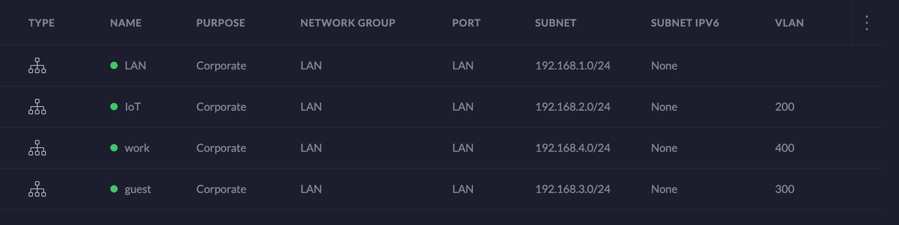
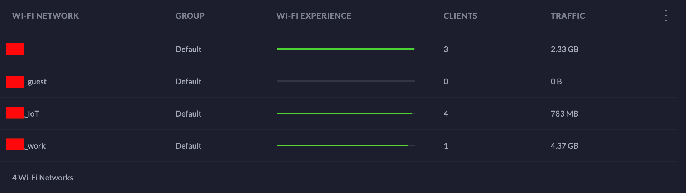
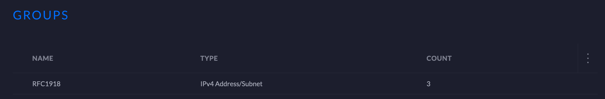
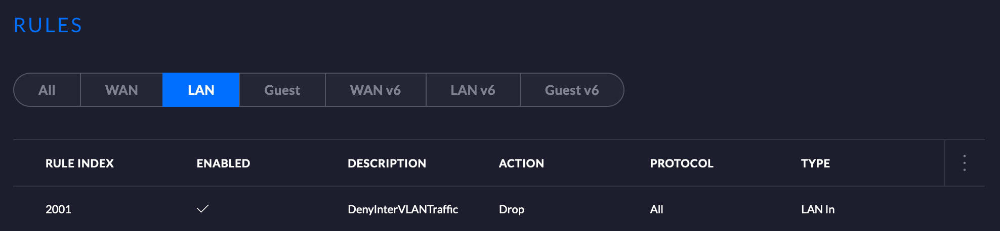

# Ubiquiti Unifi Dream Machine Setup

## Description

This repository is an example of how you can set up your home network running on [Ubiquiti's Unifi Dream Machine (UDM)](https://store.ui.com/collections/routing-switching/products/unifi-dream-machine)
(probably on other Ubiquiti's products as well, but, I only have the UDM and thus cannot vouch for the others)
using [Terraform](https://www.terraform.io/) and its [community provider](https://www.terraform.io/docs/providers/type/community-index.html) for [Unifi](https://github.com/paultyng/terraform-provider-unifi).

## Acknowledgements

Kudos to [Paul Tyng](https://github.com/paultyng) for [the creation of the Unifi provider for Terraform](https://thenewstack.io/how-to-manage-a-home-network-with-infrastructure-as-code/)!

## Caveats

+ this example uses [Terraform v0.13](https://www.terraform.io/upgrade-guides/0-13.html)
+ I use [the `terraform.tfvars` file](https://www.terraform.io/docs/configuration/variables.html#variable-definitions-tfvars-files) for passing the secrets in. If you plan on doing the same, [you ought to git ignore it](https://stackoverflow.com/questions/52293453/how-to-keep-secret-key-information-out-of-git-repository)
+ the credentials I use for running Terraform on my UDM come from a super admin user who had been created outside of Terraform (manually, through the UDM's GUI)
+ the default LAN network, the one that's created automatically upon the first boot of the UDM, is excluded on purpose from this setup
+ if, as myself, you're too lazy to plug your machine to the UDM with an ethernet cable, expect errors (e.g. `Error: unable to determine API URL style: ...`) caused by the intermittent disruptions of the WiFi connection that occur when UDM applies your changes
+ there are two important aspects of Terraform that you should consider before adopting this example:
  + [Backends](https://www.terraform.io/docs/backends/index.html)
  + [Sensitive Data in State](https://www.terraform.io/docs/state/sensitive-data.html)

## Running

Use [the Core Terraform Workflow](https://www.terraform.io/guides/core-workflow.html#working-as-an-individual-practitioner):

**a)** git clone this repo

```bash
git clone git@github.com:rafalkrol-xyz/ubiquity-unifi-dream-machine-setup-example.git
```

**b)** make the necessary changes to Terraform variables (e.g. set the proper `password` and `username`)

**c)** initialize Terraform

```bash
terraform init
```

**d)** review plan

```bash
terraform plan
```

**e)** if happy with everything, apply the changes

```bash
terraform apply
```

## Pieces of the networking puzzle

If you started with the default UDM settings, this is what you should end up with:

+ networks



+ Wi-Fi networks



+ firewall groups



+ firewall rules


